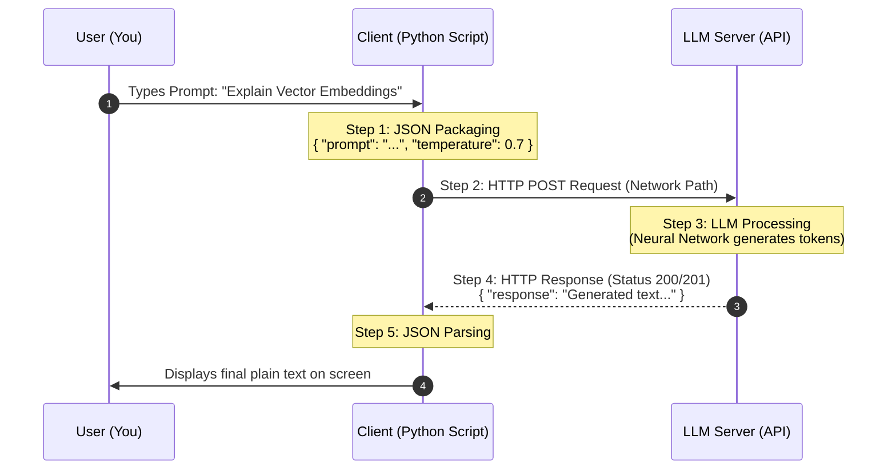

# The Concept Vault: AI Architecture Visualized

## Concept 1: The LLM POST Request Payload

This sequence diagram visualizes how a text prompt is packaged into JSON and delivered to an AI server via an HTTP POST request.

